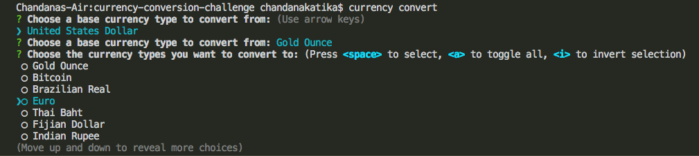
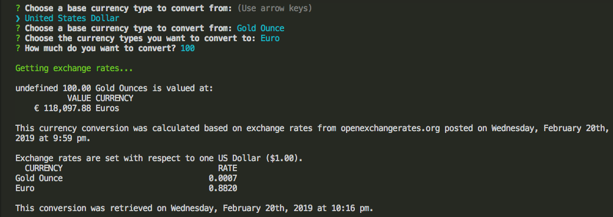
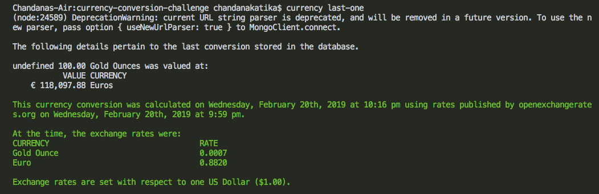
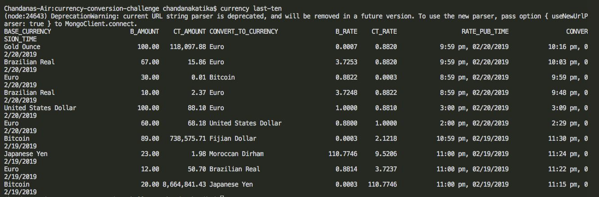
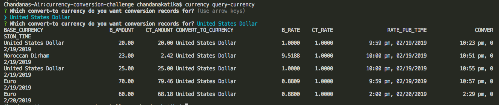
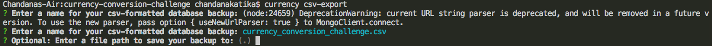

## 💸Currency Conversion Challenge💸    
Currency Conversion challenge is a `command-line application` that allows a user to do monetary conversions from one currency to one or more currencies.   

### Technologies and Dependencies for Packages Used      
- `Node.js`,`Javascript`, `MongoDB`, `Mongoose`.    
- `npm init`, `npm i inquirer`, `JSON package: npm init -y`, `.gitignore file`, `npm i commander`, `npm i columnify`, `npm i currency-symbole-map`, `npm i dotenv`, `npm i json2csv`, `npm i moment`, `npm i mongoose`, `npm i mongoose-validator`, `npm i pluralize`, `npm i request`.
- API key obtained and used from `openexchangerates.org`.   
- `commander` and `inquirer` packages are used to support the interface of this command-line application by prompting commands regarding the type of currency to choose from, convert to and other basic interactions for the user.   
- `request` and `dotenv` packages allows access to real-time data using the API key obtained from `openexchangerates.org`.   
- User is able to retrieve a history of conversions performed as the currency conversion record validation is stored using `mongoose DB`.   
- `CSV` export uses the `json2csv` package to export all of the historical currency conversions. 

## Instructions   
- After cloning the github repo, navigate into the root of the project directory(currency-conversion-challenge).  
- Install Node.js and all the required dependencies using `sudo npm i -g`. For access of all the `currency` command options, enter currency --help.
- When you enter the command `currency convert`, the application prompts the user to type-in the currency names and a value to convert. Also displays information of the exchange rates for any currency input set for a standard of one US Dollar.   
   
 
- `currency last-one` retrieves a record of the last conversion.    
    
- `currency last-ten` retrieves upto ten of the most recent conversions.   
    
- `currency query-currency` retrieves and displays details for a selected currency.    
     
- `csv-export` allows `ALL historical conversions` to be exported to a `.csv file`.   
      

